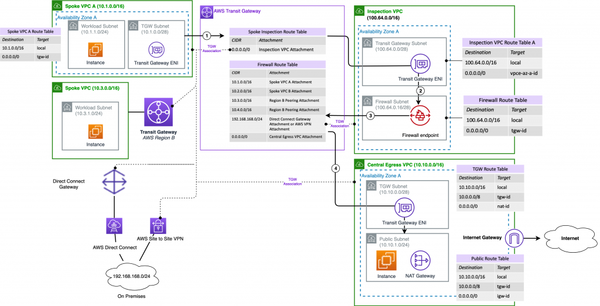

# AWS VPC Builder

The `aws-vpc-builder-cdk` project has two primary goals:

1. Provide a simple and repeatable way to deploy and explore complex networking architectures on AWS.
2. Showcase the capabilities of the AWS Cloud Development Kit (CDK) to create and orchestrate a complex architecture.

## Getting Started

Using a configuration file alone - build a complex network setup including:  
- Amazon Virtual Private Cloud (VPC)s
- An AWS Transit Gateway
- AWS VPN Connections to the AWS Transit Gateway
- Centralized Egress to the Internet
- AWS Firewall Inspection for inter-VPC traffic
- Centralized Interface endpoints for private access to AWS service endpoints
- AWS Resource Access Manager (RAM) share subnets to accounts, an Organization Unit, or an entire Organization.
- Amazon Route53 private hosted zones shared with Amazon VPCs, Inbound and Outbound DNS Resolvers.

The deployed setup can be as complex as everything above (and multiple types of each thing) to as simple as a single Amazon VPC with a single subnet in a single availability Zone.

The app supports multiple configuration files. So you can mirror setups between regions, or create isolated configurations in your account.

Taking an example from [this](https://aws.amazon.com/blogs/networking-and-content-delivery/deployment-models-for-aws-network-firewall/) blog post let's consider this network architecture:



This deployment is realized using the following configuration file:

```yaml
global:
  stackNamePrefix: sample-firewall-blog
  ssmPrefix: /sample-firewall-blog/network
  region: us-east-1
  availabilityZones:
    - us-east-1a
  tags:
    - aws-vpc-builder: sample-firewall-blog

vpns:
  vpnToGround:
    style: transitGatewayAttached
    newCustomerGatewayIp: 5.6.7.8
    newCustomerGatewayAsn: 65012
    newCustomerGatewayName: toGround-DataCenterA
    useTransit: central

providers:
  internet:
    centralEgress:
      vpcCidr: 10.10.0.0/16
      useTransit: central
      style: natEgress
  firewall:
    inspectionVpc:
      vpcCidr: 100.64.0.0/16
      useTransit: central
      style: awsNetworkFirewall
      firewallDescription: For Inspection Vpc
      firewallName: InspectionEgress

vpcs:
  SpokeVpcA:
    style: workloadIsolated
    vpcCidr: 10.1.0.0/16
    providerInternet: centralEgress
    subnets:
      workloadSubnet:
        cidrMask: 24
  SpokeVpc:
    style: workloadIsolated
    vpcCidr: 10.3.0.0/16
    subnets:
      workloadSubnet:
        cidrMask: 24

transitGateways:
  central:
    style: transitGateway
    tgwDescription: Central Transit Gateway
    dynamicRoutes:
      - vpcName: SpokeVpcA
        routesTo: SpokeVpc
        inspectedBy: inspectionVpc
    defaultRoutes:
      - vpcName: SpokeVpcA
        routesTo: centralEgress
        inspectedBy: inspectionVpc
      - vpcName: SpokeVpc
        routesTo: centralEgress
        inspectedBy: inspectionVpc
      - vpcName: inspectionVpc
        routesTo: centralEgress
    staticRoutes:
      - vpcName: SpokeVpcA
        routesTo: vpnToGround
        staticCidr: 192.168.168.0/24
      - vpcName: SpokeVpc
        routesTo: vpnToGround
        staticCidr: 192.168.168.0/24
```

When the configuration file above is ingested by this app, it will create multiple CloudFormation stacks which the CDK can deploy in the correct order.

The ~70 lines of configuration file have generated >5000 lines of CloudFormation.

After you've completed the 'Environment Setup' section below you can deploy this by running:

```bash
cdk deploy -c config=sample-firewall-blog.vpcBuilder.yaml --all --require-approval never
```

Remove the `--require-approval never` if you'd like to be asked before any IAM resources, or Security Groups are created.

After it's deployed feel free to explore.  You can make changes and re-deploy and the environment will adjust automatically.  Try removing the 'inspectedBy' from the routes and see what happens!

## Environment Setup

An AWS Cloud9 environment will contain all the tools and software to use this repository right away.  Alternately anything with a command line and a text editor should do the trick!

You can follow the getting started guide for Cloud9 [here](https://aws.amazon.com/cloud9/getting-started/)

### CDK

If you're using Cloud9, you should already have the CDK installed (use version 2).

Otherwise, you can follow [these instructions](https://docs.aws.amazon.com/cdk/latest/guide/getting_started.html#getting_started_install) to install the CDK (use version 2).

### Modules 

After installing the CDK, install the required NPM modules for the project by running:

```bash
npm install
```

### Tests

Now run the test cases to assure your environment is complete!

```bash
npm run build ; npm run test
```

If test cases don't pass, try deleting the `node_modules` folder and `package-lock.json` file.  Then re-run `npm install` and try again.

### Deployment Account

Configure your AWS CLI Credentials to work against the account you will deploy to.

If you're in an AWS Cloud9 environment this should already be done for you!  If you're not using AWS Cloud9 configure the AWS CLI using [these](https://docs.aws.amazon.com/cli/latest/userguide/cli-chap-configure.html) instructions.

Be sure to set the region to match the region you wish to deploy to.  eg:

```bash
export AWS_REGION=us-east-1
```

Run a quick test to make sure the credentials are working

```bash
aws s3 ls 
```

This command should list buckets in your deployment account.

### Bootstrap

The CDK requires a place to put assets it builds.  Bootstrap this account to handle this by running.  If you've done this before in this account you can skip this step.

```bash
cdk bootstrap
```

## Configure

Create your own configuration file in the 'config' folder in this project.  Or deploy a sample one that's included.

Each sample in the `config` directory includes a markdown file with deployment instructions and an architecture diagram.  See what samples aare available and how to deploy them [here](config/README.md).

Alternately a complete configuration file with many comments and every available option is in the `config-walkthrough.yaml` file.

Copy this file to a new file, and set it up the way you want for a deployment!

This project makes *every effort* to deploy configuration files that pass validation checks.  If you arrive at a configuration file that fails to deploy after passing validation checks, please submit a bug!

### AWS Resource Access Manager (RAM) Sharing

This project makes use of / prefers a centralized managed model for networking by utilizing [AWS RAM shared subnets](https://docs.aws.amazon.com/vpc/latest/userguide/vpc-sharing.html) from a central Network account.

This simplifies the deployment (All regional Amazon VPCs in one account) and helps centralize governance of the estate.

If you are AWS RAM sharing with an OU you will need the 'organizationId' from the AWS Organizations Service page.  The value will begin with 'o-'.

You'll also need the 'ou-' that you wish to share with.  That can be found by clicking the ou and copying the 'ou-' identifier.

Alternately you can AWS RAM share with a specific account ID by putting the Accounts ID in the `sharedWith` field.

### Synth Test

After your configuration is set up the way you wish, execute this command to verify the configuration file contents are correct.

NOTE: Nothing gets deployed by a 'synth' command, but instead it just validates the configuration contents and generates templates in the `cdk.out` folder.

You will need pass the configuration file as an option on the command line.

```bash
cdk synth -c config=[configuration-file]
```

(replace `[configuration-file]` with the filename in the 'config' directory you want to synth / test)

Errors in the configuration file will be caught and shown.  Missing values, values not the right type, extra values etc. are all caught and shown in the error messages.

### Deploy!

Once you're comfortable that everything looks good, execute a deployment!

```bash
cdk deploy -c config=[configuration-file] --all --require-approval never
```

Leave off the `--require-aproval never` if you'd like to be prompted when security groups / IAM roles will be created to allow it to proceed.

### Redeploy!

Feel free to modify the configuration file to add or remove contents.  At any point you can re-run the deploy command and the AWS CDK will handle the changes.

```text
cdk deploy -c config=[configuration-file] --all --require-approval never
```

### Destroy!

You can destroy the stacks deployed by the configuration file by running:

```text
cdk destroy -c config=[configuration-file] --all
```

## Developer

We'd love additional contributions to this project by way of new Amazon VPC styles, new network functions etc.  Open an issue to discuss your idea before submitting a pull request please!

### Re-generating the JSON Schema

After changes to the IConfig Type the schema will need to be regenerated.

```bash
typescript-json-schema --required --noExtraProps tsconfig.json IConfig > lib/config/config-schema.json
```

### Prettier

All typescript is formatted using Prettier.

```text
npx prettier --write **/**/*.ts
npx prettier --check **/**/*.ts
```

.... more to come.

## Security

See [CONTRIBUTING](CONTRIBUTING.md#security-issue-notifications) for more information.

## License

This library is licensed under the MIT-0 License. See the LICENSE file.
