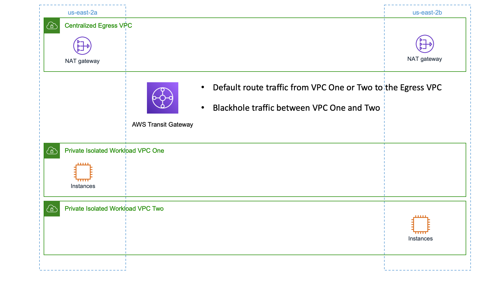

# Functional Description

We will create a VPC that is responsible for egress access to the internet via NAT gateways.

Our Transit Gateway will default route traffic to the egress VPC.  This gives us a central location to govern our egress internet connections and apply rules / inspection uniformly.  It can also save cost by reducing the number of NAT Gateways used by our AWS Estate.

# Architecture Diagram



# Resources

Assure you have available capacity in your account in us-east-1 (Virginia) before starting!

- 3 VPCs (4 if you add inspection below)
- 2 Elastic IPs
- 2 NAT Gateways
- 1 Transit Gateway
- 1 Internet Gateway

# Deployment

Assure you've followed the 'Environment Setup' section in the repositories main README [here](../README.md#Environment Setup)

Review the contents of the configuration we will deploy by viewing the [configuration file](sample-central-egress.vpcBuilder.yaml) for this sample.

Execute the deployment by running:

```text
export AWS_DEFAULT_REGION=us-east-1
cdk bootstrap -c config=sample-central-egress.vpcBuilder.yaml
cdk deploy -c config=sample-central-egress.vpcBuilder.yaml --all --require-approval=never
```

# Exploring this example

- Start an EC2 instance in Private Isolated VPC One.
- Use session manager to connect to the instance.  Setup details for session manager can be found [here](https://docs.aws.amazon.com/systems-manager/latest/userguide/session-manager-getting-started.html) if needed.
- Test internet connectivity to the instance using curl as an example `curl www.amazon.com`
- Start an EC2 instance in the other Private Isolated VPC Two.
- Verify it has internet connectivity in the same fashion.
- Attempt to ping or connect (assure your security group allows the traffic) the instance in One to Two.  Will this work?  
- What would you change in the configuration file to allow traffic to flow between the isolated VPCs?  Make that change and run the cdk deploy command shown above and test!

# Adding Inspection

An advantage of centralizing egress access to the internet is you can centralize inspection of the outbound traffic and enforce rules across your estate.

Review the contents of the configuration file with AWS Network Firewall added [here](sample-central-egress-inspected.vpcBuilder.yaml)

Re-run the deploy command to add the Network Firewall and update all the route tables to send traffic first to the firewall VPC for inspection.

```
cdk deploy -c config=sample-central-egress-inspected.vpcBuilder.yaml --all --require-approval=never
```

# Exploring inspection

- Review the transit gateway route tables.  You'll notice now traffic goes to the Firewall VPC First before getting to the Central Egress.
- Load the AWS Network Firewall service.  You'll see an existing Firewall Policy that was created by our deployment.
- Within the policy, create a new stateful [rule group](https://docs.aws.amazon.com/network-firewall/latest/developerguide/rule-groups.html).  Try adding domain inspection and denying all domains except amazon.com, check [here](https://docs.aws.amazon.com/network-firewall/latest/developerguide/rule-group-managing.html) for details.  Take special note of the section around 'inspection from outside the deployment VPC' which is what we're doing.

# Teardown

Terminate / delete any resources you created by hand.  (ec2 instances, security groups, etc).

If you explored all the way to inspection run:

```
cdk destroy -c config=sample-central-egress-inspected.vpcBuilder.yaml --all --require-approval=never
```

If you didn't provision inspection examples run:

```
cdk destroy -c config=sample-central-egress.vpcBuilder.yaml --all --require-approval=never
```

### Troubleshooting Teardown

Sometimes a stack will fail to delete because a resource is in use.  This can happen when a VPC is set to be deleted, but resources that the stack didn't create are still present.

The simplest path forward is to delete the VPC using the AWS Console and answering yes to remain any remaining resources.  Then re-runing the destroy command above!
