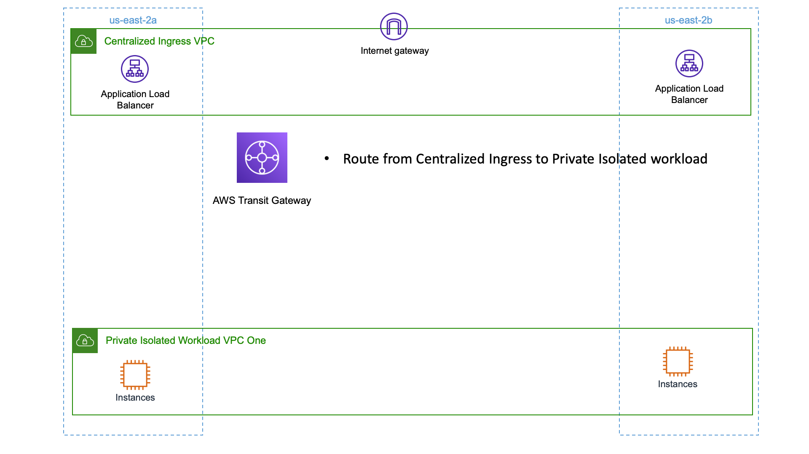

# Functional Description

We will create an Amazon VPC that is responsible for ingress internet.  Using facilities like RAM [sharing subnets](https://docs.aws.amazon.com/vpc/latest/userguide/vpc-sharing.html#vpc-sharing-share-subnet) this VPC type can be used within an estate to centralize the internet ingress function.

This centralization aids governance and response to internet based threats and allows for inspection of ingress traffic prior to being sent to downstream workload endpoints.

# Architecture Diagram



# Resources

Assure you have available capacity in your account in us-east-1 (Virginia) before starting!

- 2 VPCs (3 if you add inspection below)
- 1 Transit Gateway
- 1 Internet Gateway

# Deployment

Assure you've followed the 'Environment Setup' section in the repositories main README [here](../README.md)

Review the contents of the configuration we will deploy by viewing the [configuration file](sample-central-ingress.vpcBuilder.yaml) for this sample.

Execute the deployment by running:

```text
export AWS_DEFAULT_REGION=us-east-1
cdk bootstrap -c config=sample-central-ingress.vpcBuilder.yaml
cdk deploy -c config=sample-central-ingress.vpcBuilder.yaml --all --require-approval=never
```

# Exploring this example

- Launch an ec2 instance running a web server in the private vpc, then provision a public facing load balancer in the public VPC.

# Adding Inspection

Improve our governance and security posture by sending all traffic from the public VPC to the prviate VPC through a firewall.

Review the contents of the configuration file with AWS Network Firewall added [here](sample-central-ingress-inspected.vpcBuilder.yaml)

Re-run the deploy command to add the Network Firewall and update all the route tables to send traffic first to the firewall VPC for inspection.

```
cdk deploy -c config=sample-central-ingress-inspected.vpcBuilder.yaml --all --require-approval=never
```

# Exploring inspection

- Load the AWS Network Firewall service.  You'll see an existing Firewall Policy that was created by our deployment.
- Within the policy, create a new stateful (or stateless if preferred) [rule group](https://docs.aws.amazon.com/network-firewall/latest/developerguide/rule-groups.html).  Add a rule that only permits one TCP Port (for example TCP 443) between public and private VPCs.  Then test your rules are working!
- If you're configured to do so, RAM share the public and workload isolated VPC subnets to another account.  Add resources to that account and test.  The firewall essentially is transparent to that account!

# Teardown

Terminate / delete any resources you created by hand.  (ec2 instances, security groups, etc).

If you explored all the way to inspection run:

```
cdk destroy -c config=sample-central-ingress-inspected.vpcBuilder.yaml --all --require-approval=never
```

If you didn't provision inspection examples run:

```
cdk destroy -c config=sample-central-ingress.vpcBuilder.yaml --all --require-approval=never
```

### Troubleshooting Teardown

Sometimes a stack will fail to delete because a resource is in use.  This can happen when a VPC is set to be deleted, but resources that the stack didn't create are still present.

The simplest path forward is to delete the VPC using the AWS Console and answering yes to remain any remaining resources.  Then re-running the destroy command above!
