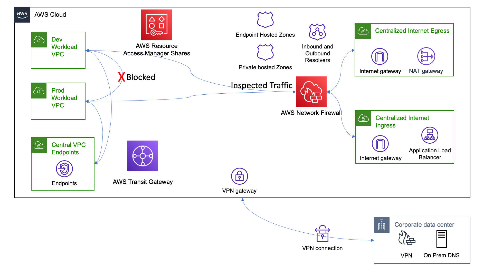

# Functional Description

Our complex example is going to bring everything together (and more).

We will:
- Provide a VPC for Dev Workloads isolated from Prod
- Provide a VPC for Prod Workloads isolated from Dev
- Centralize ingress and egress internet access.
- Pass all ingress and egress internet traffic through an AWS Network Firewall.
- Centralize VPC Endpoints.
- Provide a private hosted zone for both dev.workload.net and prod.workload.net
- Provide Route53 Endpoints for 'ground to cloud' and 'cloud to ground' name resolution.
- Provision On-premises VPN connectivity
- (optionally) RAM Share our networks to our ou-'s

# Architecture Diagram



# Resources

Assure you have available reosurces in us-east-1 (Virginia).  You will need your VPC limit raised if you've not already done so.  The default account limit is 5.

- 6 VPCs
- 1 AWS Network Firewall
- 1 VPN
- 1 IGW
- 2 NAT Gateways
- 2 Route53 resolver endpoints (inbound and outbound)
- 8 private hosted zones

# Deployment

Assure you've followed the 'Environment Setup' section in the repositories main README [here](../README.md)

Review the contents of the configuration we will deploy by viewing the [configuration file](sample-complex.vpcBuilder.yaml) for this sample.

If you plan to actually establish the VPN for exploration, provide a *REAL* Customer Gateway IP address.  This can be an Elastic IP Address from an existing VPC that you will provision an Ec2 Instance in to establish the VPN connectivity.

Execute the deployment by running:

```text
export AWS_DEFAULT_REGION=us-east-1
cdk bootstrap -c config=sample-complex.vpcBuilder.yaml
cdk deploy -c config=sample-complex.vpcBuilder.yaml --all --require-approval=never
```

# Exploration

Perhaps of interest is this configuration example synthesizes to 14 CloudFormation Templates and ~11,000 lines of JSON!

- Provision EC2 instances in the Dev and Prod VPCs and attempt to communicate with each other.  What would we change if we wanted dev to prod communication?
- Try and resolve `workload-dev` addresses from Prod and vice versa.  If we wanted this to work, what would we change?
- Set up an ALB in the public subnet and direct traffic to either of the Dev or Prod EC2 instances.  What would we add if we wanted separate ingress for dev and prod?
- Configure a firewall rule that blocks the TCP port/traffic between the ALB and the EC2 instance.  Notice if you used RAM sharing, and sign in to the Dev or Prod account - the account isn't even aware its traffic is inspected!
- Establish a VPN connection from another VPC.  Provision an EC2 instance within the 'on-prem' VPC and attempt to resolve DNS entries from 'cloud' using the dig command ie: `dig @172.16.1.2 workload-dev`.  Substitute `172.16.1.2` with the inbound resolver IP that the stack provisioned.

# Teardown

Terminate / delete any resources you created by hand.  (ec2 instances, security groups, etc) then run:

```
cdk destroy -c config=sample-complex.vpcBuilder.yaml --all --require-approval=never
```
