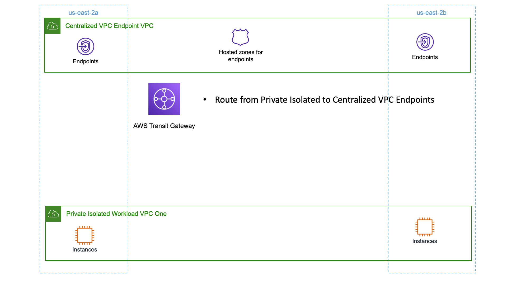

# Functional Description

We will create a VPC that is responsible for providing VPC Endpoints.  We can route traffic to these endpoints via our Transit Gateway, and provide name resolution via Route53 Private Hosted zones.

This allows us to use Private Isolated workloads, and effectively not use internet Egress, but still be able to reach selected AWS services endpoints required by our workload.

# Architecture Diagram



# Resources

Assure you have available capacity in your account in us-east-1 (Virginia) before starting!

- 2 VPCs
- 5 VPC Endpoints
- 5 Private Hosted Zones
- 1 Transit Gateway

# Deployment

Assure you've followed the setup guide in the repositories main README [here](../README.md)

Review the contents of the configuration we will deploy by viewing the [configuration file](sample-vpc-endpoints.vpcBuilder.yaml) for this sample.

The VPC Endpoints that should be created are kept in a separate configuration file.  Review [this file](sample-vpc-endpoints-us-east-1.txt) as well.

Execute the deployment by running:

```text
export AWS_DEFAULT_REGION=us-east-1
cdk bootstrap -c config=sample-vpc-endpoints.vpcBuilder.yaml
cdk deploy -c config=sample-vpc-endpoints.vpcBuilder.yaml --all --require-approval=never
```

# Exploring this example

- Start an EC2 instance in the workloadIsolated VPC.
- Use session manager to connect to the instance.  Setup details for session manager can be found [here](https://docs.aws.amazon.com/systems-manager/latest/userguide/session-manager-getting-started.html) if needed.
- Even though this VPC has no internet connectivity it can reach the SSM services required for session manager through endpoints.
- Confirm you cannot get to the internet via curl `curl http://www.amazon.com`
- Confirm you resolve `ssm.us-east-1.amazonaws.com` to a private endpoint instead of a public one.
- Edit the endpoint configuration file `sample-vpc-endpoints-us-east-1.txt` and add/remove endpoints.  Test their function and impact.  ie: Remove `com.amazonaws.us-east-1.ssm` and run the deployment.  Notice you can no longer connect to the instance via SSM.

# Teardown

Terminate / delete any resources you created by hand.  (ec2 instances, security groups, etc) then run:

```
cdk destroy -c config=sample-vpc-endpoints.vpcBuilder.yaml --all --require-approval=never
```

### Troubleshooting Teardown

Sometimes a stack will fail to delete because a resource is in use.  This can happen when a VPC is set to be deleted, but resources that the stack didn't create are still present.

The simplest path forward is to delete the VPC using the AWS Console and answering yes to remain any remaining resources.  Then re-running the destroy command above!
