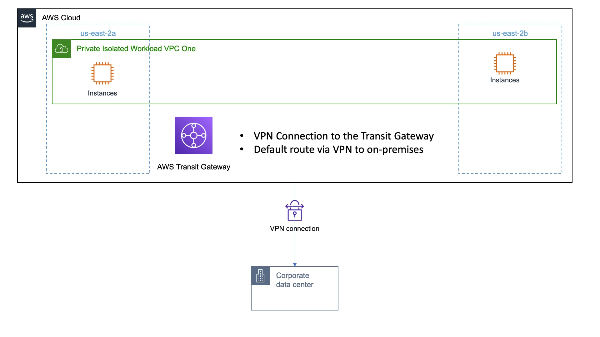

# Functional Description

We will create an isolated VPC within the AWS Cloud and a VPN connection that can be used to get back to on-premises.  This Isolated VPC will be connected to the TGW with a default route.

So we can explore our example we will also create a 'standalone' Public VPC that we can provision an EC2 instance inside-of to establish a VPN Tunnel.

We will set a default route to back through the VPN to provide all network functions (ingress / egress etc).

# Architecture Diagram



# Resources

Assure you have available capacity in your account in us-east-1 (Virginia) before starting!

- 2 VPCs
- 1 Transit Gateway
- 1 AWS Managed VPN

# Deployment

Assure you've followed the setup guide in the repositories main README [here](../README.md)

Review the contents of the configuration we will deploy by viewing the [configuration file](sample-vpn-onprem.vpcBuilder.yaml) for this sample.

If you plan to actually establish the VPN for exploration, provide a *REAL* Customer Gateway IP address.  This can be an Elastic IP Address from an existing VPC that you will provision an Ec2 Instance in to establish the VPN connectivity.

Execute the deployment by running:

```text
export AWS_DEFAULT_REGION=us-east-1
cdk bootstrap -c config=sample-vpn-onprem.vpcBuilder.yaml
cdk deploy -c config=sample-vpn-onprem.vpcBuilder.yaml --all --require-approval=never
```

# Exploring this example

Follow these instructions to connect to this VPN connection the testing VPC to actually test that things are working!

## Testing the VPN with an Ec2 instance

**NOTE** If you didn't allocate an ElasticIP Address in `us-east-1` you will need to tear down and start over.  Assure the EIP is/was set to the 'newCustomerGatewayIp' in the configuration file example.

### PSK into Secrets manager

Navigate to the 'Site-to-site VPN Connections' and Download the VPN configuration that was deployed.  Use the 'generic' settings versus anything for a specific vendor.

Modify the values below to reflect the region and AZ.  Replace '[value-from-config-file]' with the PSK value.

```
aws secretsmanager create-secret \
--name "/vpn/connect/Tunnel1" \
--description "Pre shared key for VPN Tunnel One" \
--secret-string  '{"psk":"place-value-here"}' \
--region us-east-1
```

```
aws secretsmanager create-secret \
--name "/vpn/connect/Tunnel2" \
--description "Pre shared key for VPN Tunnel Two" \
--secret-string  '{"psk":"place-value-here"}' \
--region us-east-1
```

The template for the Instance portion of the VPN is taken from this blog post: [here](https://aws.amazon.com/blogs/networking-and-content-delivery/simulating-site-to-site-vpn-customer-gateways-strongswan/)

You can find the template you'll need in this repository in `extras/vpn-gateway-strongswan.yml`

In the instructions in the blog linked above, skip steps 1 to 4 and go to `5. Deploy strongSwan VPN gateway stack to your on-premises VPC`

When deploying - the blog shows you the values you need from your VPN configuration file that go into the template.  Much of it is left blank since it allows for certificate based VPN versus a PSK.

Note you'll need your eipalloc- EIP ID for deployment so note it down before you deploy.

Make sure you deploy to the 'onpremsimulator' VPC and not the 'workloadisolated' VPC.

It will take a little while to deploy.

Once Finished modify the route tables of your VPC to send traffic matching your VPC CIDR on the Amazon managed side to the interface ID of your ec2 instance.

**VERY IMPORTANT** Your ec2 instance is an availability zone and has an ENI in that AZ.  When you deploy a 'test' resource it must be in the same AZ in order to work!

So if your VPN ec2 instance is 'us-east-1b' you must deploy your 'test workload' in us-east-1b' as well after you've modified the subnet route tables to route to the ENI of the EC2 VPN instance.

### Verify the tunnels show up

Give 5 minutes or so for the tunnels to stabilize after install is done.

They BOTH will come up.  If only one comes up delete the template and try again.  A copy/paste error likely occurred.

### Verify your transit routes

The transit routes likely showed blackholed when the tunnels were down.  Now they should show as Active routes.

Deploy a resource on either side and test connectivity!  Make sure your security groups are set up the right way to allow traffic from each-other's CIDR.

Enjoy!

# Teardown

Terminate / delete any resources you created / Delete the EC2 based VPN endpoint you deployed.  (ec2 instances, security groups, etc) then run:

```
cdk destroy -c config=sample-vpn-onprem.vpcBuilder.yaml --all --require-approval=never
```

### Troubleshooting Teardown

For this stack it will sometimes fail to remove the Transit Gateway since the VPN has not completely deleted itself.  Simply re-run the delete command above and it should succeed.

Sometimes a stack will fail to delete because a resource is in use.  This can happen when a VPC is set to be deleted, but resources that the stack didn't create are still present.

The simplest path forward is to delete the VPC using the AWS Console and answering yes to remain any remaining resources.  Then re-running the destroy command above!
